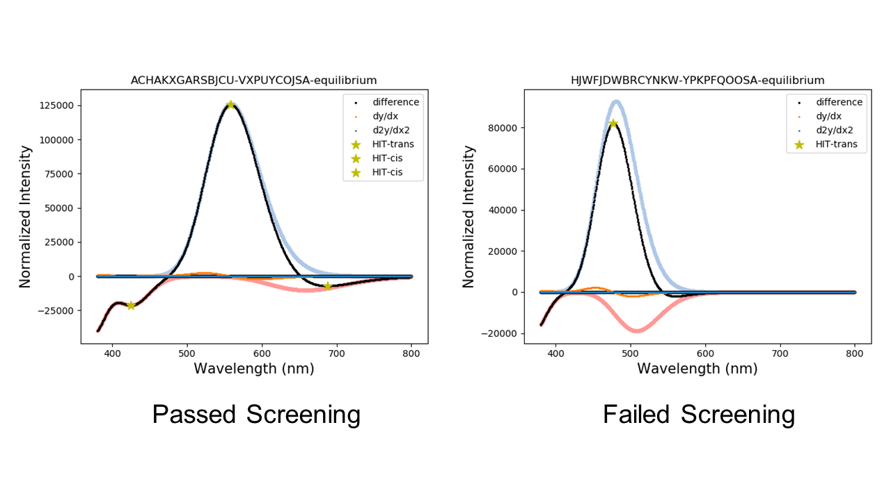

# Azoarene-Screen-Photophysics
Screen azoarene spectra for ideal photoswitching qualities

We consider a molecule to have ‘passed screening’ if there is a distinct cis and trans absorbance peaks the visible range (300–800 nm by default). 

The algorithm first computes the trans–cis difference spectrum. Maxima on the difference spectrum represent places where there is high trans absorbance and low cis absorbance; whereas minima represent places where there is high cis absorbance and low trans absorbance. If the absorbance value for a difference spectrum peak is at least 70% of the corresponding raw cis/trans spectrum, it is a hit. This last step prevents small cis/trans absorbance differences from registering false positives. Any minima or maxima on the difference spectrum that meet this criteria are designated as a hit, and a hit for both cis and trans passes screening. 

INPUT:

      cis and trans TDDFT log files
  
USAGE:

       python3 screen-photophysics.py <cis.log> <trans.log>
   
       *note this is intended for use on unix machines
   
OUTPUT:

    1. png of spectra with difference plot and 'HIT' peaks highlighted
    
    2. file containing list of excitations for cis and trans
    
    3. file containing list of unique absorbance peaks for cis and trans
    
    
    
Variables to modify for other use cases:
    'nstates'  - By default is set to 10, if more states were calculated by TDDFT, increase this number to include them
    
    'start'    - energy in nm to start screening
    
     'end'     - energy in nm to end screening
     
     'sigma'   - controls the braodening parameter for the gaussian fit. 0.4 is gview default, 0.2 is azoarene default used in this program
     
     'name'    - is used to define how plot title, png name, and HITs list are named. By default it is named after the cis log file name. This can be changed to suit whatever naming scheme is desired.
  
